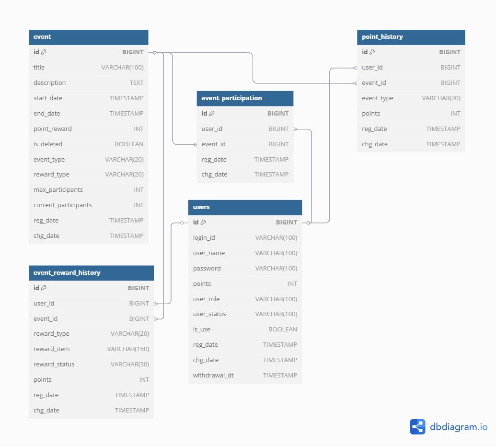

## 📖 목차
- [📌 소개](#📌-소개)
- [🛠️ 기술 스택](#🛠️-기술-스택)
- [✨ 주요 기능](#✨-주요-기능)
- [🔍 참여 로직 상세](#🔍-참여-로직-상세)
- [🔧 도메인 구조](#🔧-도메인-구조)
- [📄 API 문서](#📄-api-문서)
- [✅ 테스트](#✅-테스트)
- [📦 배포](#📦-배포)

---

## 📌소개
해당 프로젝트는 사용자가 다양한 이벤트에 참여하고, 참여 시 포인트를 적립・조회할 수 있는 웹 서비스입니다.
- Spring Boot + JPA + QueryDSL
- Redis 캐시로 실시간 포인트 조회, Redisson 분산락 사용으로 동시성 제어 등 실무 기능 연습 목적

---

## 🛠️ 기술 스택
- Java 17
- Spring Boot 3.2.3
- Spring Data JPA
- Redis (중복 참여 방지, 캐시)
- MySQL
- Swagger (API 명세)
- Postman (요청 시나리오 테스트)

#### Redis 도입 이유
- 포인트 조회 API에 캐싱 적용 -> 자주 호출되는 API의 응답 속도 개선
- 선착순 이벤트에는 분산 Lock 활용 -> 중복 참여 방지 및 트래픽 버퍼링 기능

---

## ✨ 주요 기능
1. **이벤트 CRUD**
2. **사용자 가입 및 로그인 (JWT 인증)**
3. **이벤트 참여 (출석체크 or 일반 이벤트)**
4. **참여 결과에 따라 포인트 적립**
5. **마이페이지에서 포인트/참여 내역 조회**
6. **관리자용 참가자 조회 & 통계 페이지**

## 🔍 참여 로직 상세

---

## 🔧 도메인 구조

 
  
 DBML

    Table event {
    id BIGINT  [primary key]
    title VARCHAR(100)
    description TEXT
    start_date TIMESTAMP
    end_date TIMESTAMP
    point_reward INT
    is_deleted BOOLEAN [default: false]
    event_type VARCHAR(20)  [note: 'SURVEY, QUIZ, GIVEAWAY, CHECKIN, OTHER']
    reward_type VARCHAR(20)  [note: 'FIRST_COME, DRAW, INSTANT']
    max_participants INT
    current_participants INT
    reg_date TIMESTAMP
    chg_date TIMESTAMP
    }
    
    Table users {
    id BIGINT [primary key]
    login_id  VARCHAR(100) [unique]
    user_name VARCHAR(100)
    password VARCHAR(100)
    points INT  [default:  0]
    user_role VARCHAR(100)
    user_status VARCHAR(100)
    is_use BOOLEAN
    reg_date TIMESTAMP
    chg_date TIMESTAMP
    withdrawal_dt TIMESTAMP
    }
    
    Table event_participation {
    id BIGINT [primary key]
    user_id  BIGINT
    event_id  BIGINT
    reg_date TIMESTAMP
    chg_date TIMESTAMP
    }
    
    Table point_history {
    id BIGINT [primary key]
    user_id  BIGINT
    event_id  BIGINT
    event_type VARCHAR(20)
    points INT [default: 0]
    reg_date TIMESTAMP
    chg_date TIMESTAMP
    }
    
    Table event_reward_history {
    id BIGINT [primary key]
    user_id  BIGINT
    event_id  BIGINT
    reward_type VARCHAR(20)
    reward_item VARCHAR(150)
    reward_status VARCHAR(30) [note: 'WIN, LOSE, PENDING']
    points INT [default: 0]
    reg_date TIMESTAMP
    chg_date TIMESTAMP
    }
    
    
    
    Ref: "users"."id" < "event_participation"."user_id"
    
    Ref: "event_participation"."event_id" > "event"."id"
    
    Ref: "users"."id" < "point_history"."user_id"
    
    Ref: "event"."id" < "point_history"."event_id"
    
    Ref: "users"."id" < "event_reward_history"."user_id"
    
    Ref: "event"."id" < "event_reward_history"."event_id"

---

## 📄 API 문서 (Swagger)
- [Swagger UI (로컬)](http://localhost:8080/swagger-ui/index.html)
- JWT 인증이 필요한 API는 상단에 "🔒 Authorize" 버튼을 통해 토큰을 입력 후 테스트 할 수 있습니다.
- 사용자 / 관리자 권한에 따라 접근 가능한 API가 다릅니다.

### 💡 JWT 인증 테스트 방법
1. `/auth/login` API를 통해 토큰을 발급받습니다.
2. Swagger 상단 "🔒 Authorize" 버튼을 클릭합니다.
3. `Bearer <JWT 토큰>` 형태로 입력합니다.
4. 인증이 필요한 API들을 테스트할 수 있습니다.

> 📌 현재는 로컬 환경에서만 Swagger UI를 통해 API를 확인할 수 있습니다.  
> 추후 배포 시 `https://evently.com/swagger-ui/index.html` 형태로 외부에서도 접근 가능하도록 설정할 예정입니다.

--- 

## ✅ 테스트
### 1. 서비스 단위 테스트
- 서비스 레이어 단위 테스트 작성
- @Mock, @InjectMocks을 활용해서 의존성을 주입하고 동작 검증
- 주요 테스트 항목 :
  - 이벤트 참여 로직 (Strategy 패턴 적용 여부 및 포인트 적립 결과 검증)
  - 마이페이지 : 사용자 참여 이력 조회
  - 관리자 페이지 : 이벤트별 참가자 조회
  - 오늘 날짜 기준 출석 이벤트 확인 조회
    
### 2. 전략 패턴 단위 테스트 
- 전략 별 단위 테스트를 통해 개별 로직 검증
- 출석체크 이벤트 전략(AttendanceEventStrategy) 에 대해 다음 케이스 검증 완료:
- ✅ 오늘 이미 참여한 경우 예외 발생
- ✅ 락 획득 실패 시 예외 처리
- ✅ 정상 참여 시 포인트 지급 및 참여 저장 로직 호출 확인
- Redisson Lock 활용 → 락 획득 여부에 따른 흐름 분기 처리