```mermaid
erDiagram
  USER ||--o{ EVENT_PARTICIPATION       : participates
  EVENT ||--o{ EVENT_PARTICIPATION      : has_participation
  USER }|..|{ POINT_HISTORY             : accumulates

  %% — ë¯¸ë˜ í™•ì¥
  EVENT ||--o{ SURVEY_QUESTION          : has_questions_future
  SURVEY_QUESTION ||--o{ SURVEY_RESPONSE : answered_by_future
  USER ||--o{ SURVEY_RESPONSE           : submits_future
```

## 📖 목차
- [📌 소개](#📌-소개)
- [✨ 주요 기능](#✨-주요-기능)
- [🔍 참여 로직 상세](#🔍-참여-로직-상세)
- [🛠️ 기술 스택](#🛠️-기술-스택)
- [🔧 도메인 구조](#🔧-도메인-구조)
- [🚀 설치 및 실행](#🚀-설치-및-실행)
- [📄 API 문서](#📄-api-문서)
- [🎨 예시 화면](#🎨-예시-화면)
- [✅ 테스트](#✅-테스트)
- [📦 배포](#📦-배포)

## 📌소개
해당 프로젝트는 사용자가 다양한 이벤트에 참여하고, 참여 시 포인트를 적립・조회할 수 있는 웹 서비스입니다.
- Spring Boot + JPA + QueryDSL
- Redis 캐시로 실시간 포인트 조회, Redisson 분산락 사용으로 동시성 제어 등 실무 기능 연습 목적

## ✨ 주요 기능
1. **이벤트 CRUD**
2. **사용자 가입 및 로그인 (JWT 인증)**
3. **이벤트 참여 (출석체크 or 일반 이벤트)**
4. **참여 결과에 따라 포인트 적립**
5. **마이페이지에서 포인트/참여 내역 조회**
6. **관리자용 참가자 조회 & 통계 페이지**

## 🔍 참여 로직 상세

## 🛠️ 기술 스택
- Java 17
- Spring Boot 3.2.3
- Spring Data JPA
- Redis (중복 참여 방지, 캐시)
- MySQL
- Swagger (API 명세)
- Postman (요청 시나리오 테스트)

#### Redis 도입 이유
- 포인트 조회 API에 캐싱 적용 -> 자주 호출되는 API의 응답 속도 개선
- 선착순 이벤트에는 분산 Lock 활용 -> 중복 참여 방지 및 트래픽 버퍼링 기능

## 🔧 도메인 구조
